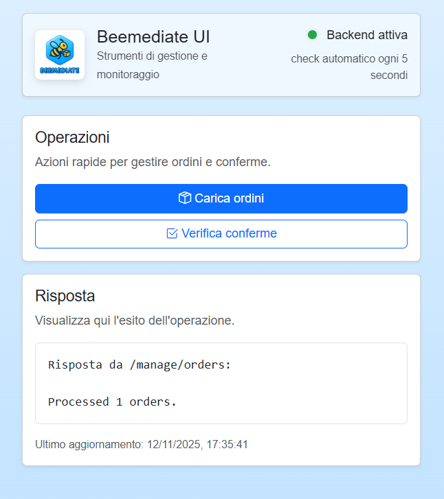
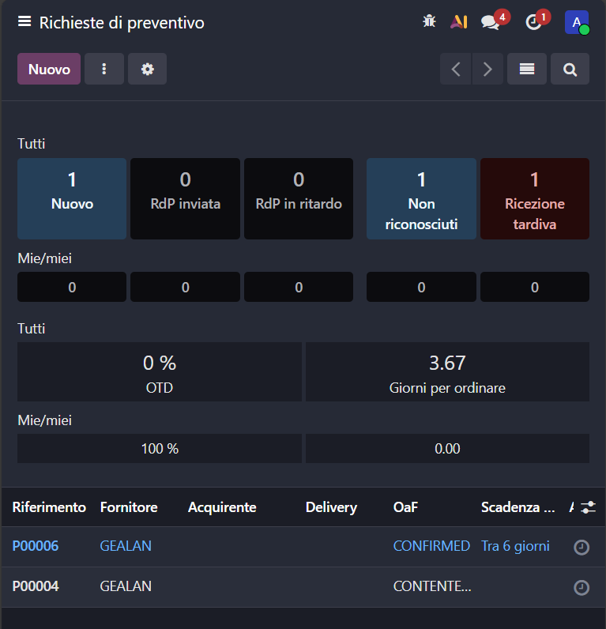
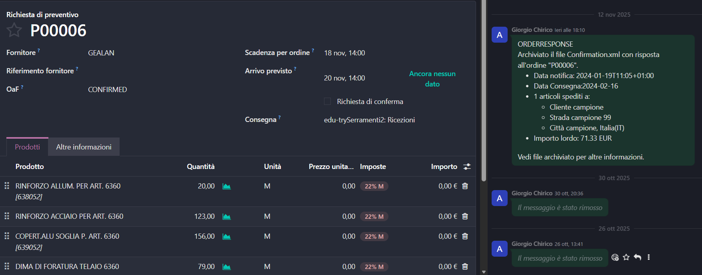
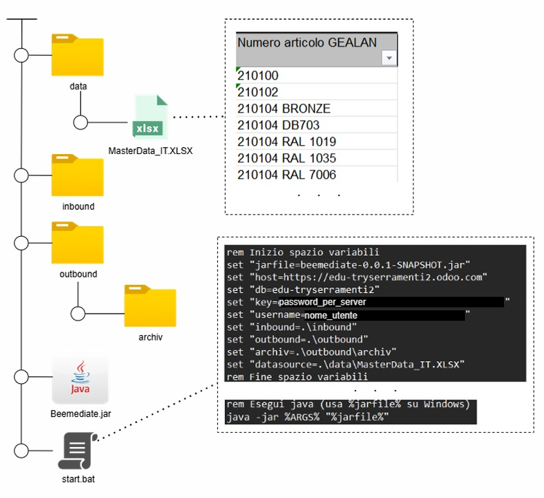

# Beemediate


A framework for immediate translation of ODOO Request For Purchase to XML-Opentrans.

Technical Documentation, with reports included, is hosted on Github Pages. See [project information](https://giorgio-hash.github.io/Beemediate/site/project-info.html).
- See [Javadoc for code](https://giorgio-hash.github.io/Beemediate/site/apidocs/index.html).
- See [Javadoc for testing](https://giorgio-hash.github.io/Beemediate/site/testapidocs/index.html).
- See [Project Reports](https://giorgio-hash.github.io/Beemediate/site/project-reports.html) from PMD, CPD, SpotBugs and JaCoCo.

## Overview
Beemediate è un software che permette di convertire gli Ordini di Acquisto di Odoo in strutture dati di formato XML-OpenTrans. Esso funziona tramite le Odoo External Api. Appena trova un ordine pendente per il fornitore designato, Beemediate estrae dai model di Odoo i dati necessari per generare la struttura XML-OpenTrans.
<p align="center">

</p>
Beemediate gestisce le comunicazioni FTP tra fornitore XML-OpenTrans e cliente di un gestionale Odoo. Appena trova una conferma d'ordine, manda una notifica al CRM attraverso messaggi sul workflow dell'Ordine di Acquisto.
<p align="center">

</p>
<p align="center">

</p>

## Setup
E' possibile modificare le impostazioni del programma interagendo via riga di comando, con un'impostazione tipo la seguente in cmd (modificare a favore del proprio caso specifico):
```cmd
@echo off
SETLOCAL

rem Inizio spazio variabili
set "jarfile=beemediate-0.0.1-SNAPSHOT.jar"
set "host=https://edu-sito.odoo.com"
set "db=sito-db"
set "key=Un4Chiave4C4s0"
set "username=miamail@esempio.it"
set "inbound=.\inbound"
set "outbound=.\outbound"
set "archiv=.\outbound\archiv"
set "datasource=.\data\MasterData_IT.XLSX"
rem Fine spazio variabili

set "ARGS="

rem Check each variable: defined and not empty string
if defined host (
    if not "%host%"=="" set "ARGS=%ARGS% -Dapi.host=%host%"
)
if defined db (
    if not "%db%"=="" set "ARGS=%ARGS% -Dapi.db=%db%"
)
if defined key (
    if not "%key%"=="" set "ARGS=%ARGS% -Dapi.key=%key%"
)
if defined username (
    if not "%username%"=="" set "ARGS=%ARGS% -Dapi.username=%username%"
)
if defined inbound (
    if not "%inbound%"=="" set "ARGS=%ARGS% -Dftp.inbound=%inbound%"
)
if defined outbound (
    if not "%outbound%"=="" set "ARGS=%ARGS% -Dftp.outbound=%outbound%"
)
if defined archiv (
    if not "%archiv%"=="" set "ARGS=%ARGS% -Dftp.archived=%archiv%"
)

if defined datasource (
    if not "%datasource%"=="" set "ARGS=%ARGS% -Ddatasource.path=file:%datasource%"
)

rem Esegui java (usa %jarfile% su Windows)
java -jar %ARGS% "%jarfile%"

ENDLOCAL
```
Esempio di disposizione dei vari file:
<p align="center">

</p>
